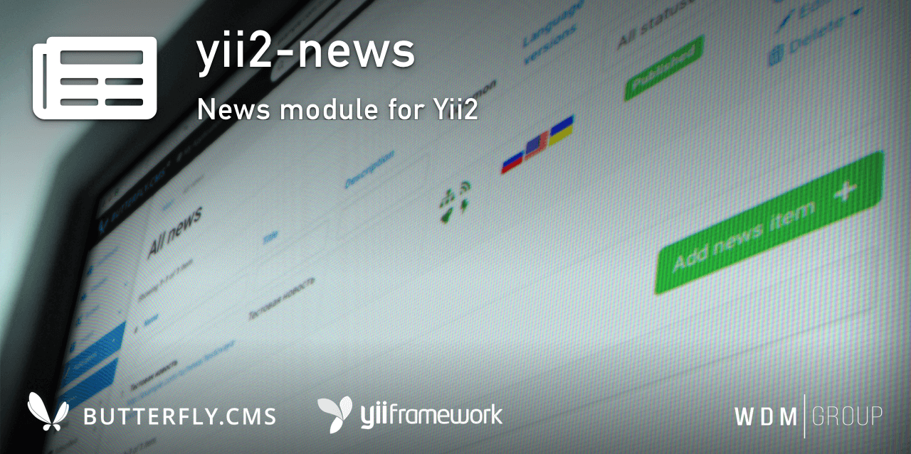

# Yii2 News
News module for Yii2.

The module have multilanguage support and integration with Sitemaps, RSS-feeds, Google AMP and Yandex.Turbo modules.

This module is an integral part of the [Butterfly.СMS](https://butterflycms.com/) content management system, but can also be used as an standalone extension.

Copyrights (c) 2019-2020 [W.D.M.Group, Ukraine](https://wdmg.com.ua/)

# Requirements 
* PHP 5.6 or higher
* Yii2 v.2.0.35 and newest
* [Yii2 Base](https://github.com/wdmg/yii2-base) module (required)
* [Yii2 Translations](https://github.com/wdmg/yii2-translations) module (optionaly)
* [Yii2 Editor](https://github.com/wdmg/yii2-editor) widget
* [Yii2 SelectInput](https://github.com/wdmg/yii2-selectinput) widget

# Installation
To install the module, run the following command in the console:

`$ composer require "wdmg/yii2-news"`

After configure db connection, run the following command in the console:

`$ php yii news/init`

And select the operation you want to perform:
  1) Apply all module migrations
  2) Revert all module migrations

# Migrations
In any case, you can execute the migration and create the initial data, run the following command in the console:

`$ php yii migrate --migrationPath=@vendor/wdmg/yii2-news/migrations`

# Configure
To add a module to the project, add the following data in your configuration file:

    'modules' => [
        ...
        'news' => [
            'class' => 'wdmg\news\Module',
            'routePrefix' => 'admin',
            'baseRoute'  => '/news', // default routes to rendered news in @frontend (use "/" - for root)
            'baseLayout' => '@app/views/layouts/main', // default layout to render news in @frontend
            'imagePath' => '/uploads/news', // the default path to save news thumbnails in @webroot
            'supportLocales' => ['ru-RU', 'uk-UA', 'en-US'] // list of support locales for multi-language versions
        ],
        ...
    ],

# Routing
Use the `Module::dashboardNavItems()` method of the module to generate a navigation items list for NavBar, like this:

    <?php
        echo Nav::widget([
        'options' => ['class' => 'navbar-nav navbar-right'],
            'label' => 'Modules',
            'items' => [
                Yii::$app->getModule('news')->dashboardNavItems(),
                ...
            ]
        ]);
    ?>

# Status and version [ready to use]
* v.1.1.3 - URL redirect notify, defaultController property, update dependencies and README.md
* v.1.1.2 - Update README.md and dependencies
* v.1.1.1 - Added AliasInput::widget()
* v.1.1.0 - Multi-language support
* v.1.0.10 - Log activity
* v.1.0.9 - Added pagination, up to date dependencies
* v.1.0.8 - Refactoring. Migrations bugfix
* v.1.0.7 - Image save bugfix
* v.1.0.6 - Added support for RSS-feed, Yandex.Turbo and Google AMP modules
* v.1.0.5 - Added support for Sitemap module